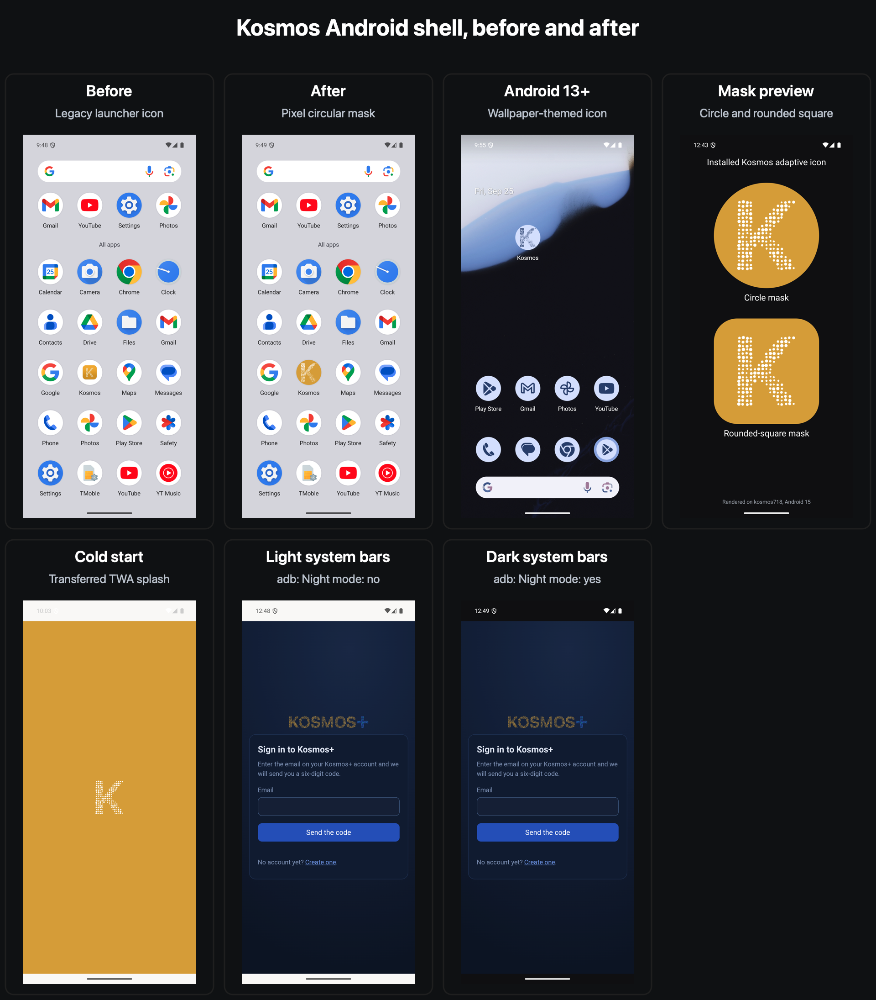

# Android shell evidence for #718

This sheet was captured from the `kosmos718` Android 15 AVD using the signed
release APK for `io.kosmos.app`.

- Before: the legacy density icon from the previously installed build.
- After: the adaptive icon under Pixel Launcher's circular mask.
- Android 13+: the monochrome K rendered by Pixel Launcher's themed-icon mode.
- Mask preview: the installed adaptive icon layers clipped on-device through
  circle and rounded-square paths. The Play system image exposes only Pixel's
  circular launcher mask and does not permit root overlay fabrication, so the
  second shape is explicitly labeled as a preview rather than another launcher.
- Cold start: Android Browser Helper's transferred TWA splash after adding its
  required private `FileProvider`. The gold field and centered white K replace
  the previous white handoff.
- Light and dark mode: the navy site content remains unchanged and is not the
  mode proof. The Android-controlled top status bar and bottom navigation bar
  switch from `#faf9f7` with dark controls to `#0c0d0f` with light controls.
  Before each capture, `adb shell cmd uimode night` reported `Night mode: no`
  for the light panel and `Night mode: yes` for the dark panel. The app and
  Chrome were both stopped between captures so the TWA read fresh metadata.

The mask preview loads `io.kosmos.app` through Android's package manager and
draws its installed `AdaptiveIconDrawable` background and foreground. Both
shapes retain the complete dotted K with visible margin.
